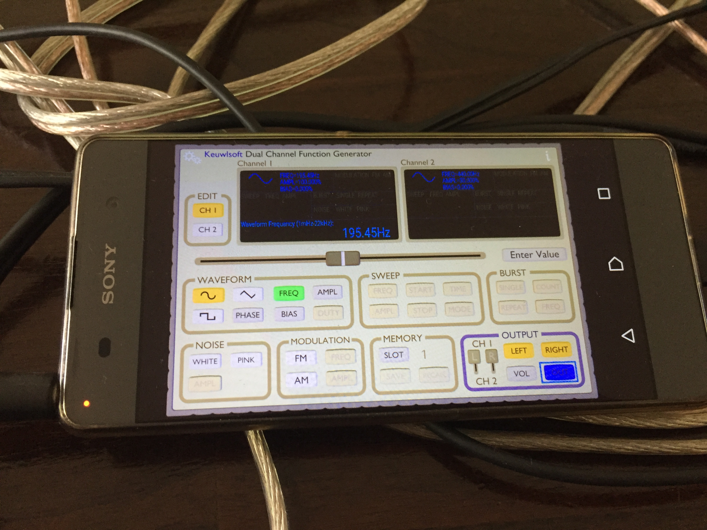

.. staandegolf documentation master file, created by
   sphinx-quickstart on Mon Apr 17 18:50:13 2017.
   You can adapt this file completely to your liking, but it should at least
   contain the root `toctree` directive.

Welcome to staandegolf's documentation!
=======================================

Voor een open en gesloten uiteinde geldt:

 :math:`l=\left(2 \cdot n - 1 \right) \cdot \frac{1}{4} \lambda`

Bij een buis van gegeven lengte :math:`l` waarvan een zijde is gesloten en de
andere open, ontstaan er staande golven bij de golflengtes die door bovenstaande
relatie zijn gegeven.

Door gebruik te maken van de formule :math:`v=\lambda \cdot f` kunnen we de
frequenties berekenen die staande golven opleveren.

Doel proef
++++++++++

Onderzoeken of staande golven in een buis zichtbaar zijn te maken door middel van
rook.

Opstelling
++++++++++

Benodigdheden
-------------

1. doorzichtige buis
2. luidspreker
3. rookgenerator
4. functiegenerator
5. fototoestel
6. versterker

De opstelling bestaat uit een doorzichtige buis waar de staande golven in worden
opgewekt, een luidspreker die op de buis gemonteerd kan worden, een functiegenerator
voor het opwekken van golven van een bepaalde frequentie, een versterker om het
signaal van de frequentiegenerator om te zetten naar een signaal voor de luidspreker en
een rookgenerator.

Met behulp van een computer maken we een tabel van frequenties die we gaan instellen op
de functiegenerator.

+--------------+---+----------+
| frequentie   | n |   lambda |
+==============+===+==========+
| 65.15        | 1 |   0.25   |
+--------------+---+----------+
| 195.45       | 2 |   0.75   |
+--------------+---+----------+
| 325.75       | 3 |   1.25   |
+--------------+---+----------+
| 456.06       | 4 |   1.75   |
+--------------+---+----------+
| 586.36       | 5 |   2.25   |
+--------------+---+----------+

 .. figure:: ./IMG_0938.JPG
    :height: 600px
    :alt: opstelling

Uitwerking
----------

Grondtoon
---------

 .. image:: ./IMG_0958.JPG
    :height: 600px

Eerste boventoon
----------------

 .. image:: ./IMG_0963.JPG
    :height: 600px

Tweede boventoon
----------------

 .. image:: ./IMG_0942.JPG
    :height: 600px

Derde boventoon
---------------

 .. image:: ./IMG_0952.JPG
    :height: 600px

Berekeningen
------------

Vergelijk met de berekende grafieken voor resp. *n* = 0, 1, 2, 3:

  .. image:: ./grafiek.png
     :height: 600px

Discussie
+++++++++

Als we de afbeeldingen van de rook vergelijken met de snelheid/plaats grafieken,
dan lijkt het erop dat er een rook ophoping plaatsvindt waar de snelheid 0 is,
bij de snelheidsknopen dus.

Contents
++++++++

.. toctree::
   :maxdepth: 2

.. automodule:: staandegolf
   :members:

Indices and tables
==================

* :ref:`genindex`
* :ref:`modindex`
* :ref:`search`
